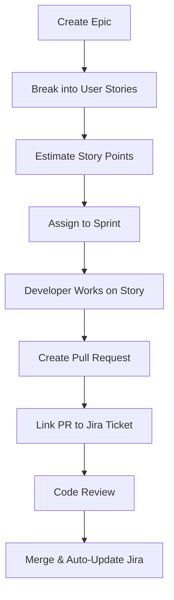

# 🤖 AI & Development Tools Integration Guide

This comprehensive guide provides detailed instructions for integrating and using the essential AI and development tools added to your platform.

## 📋 Tools Overview

| Tool | Category | Primary Roles | Integration Type |
|------|----------|---------------|------------------|
| **GitHub Copilot** | Frontend/Backend Dev | All Developers | IDE Extension |
| **ChatGPT API** | API Development | Full Stack Devs | API Integration |
| **Claude API** | API Development | Backend/Full Stack | API Integration |
| **Jira** | Project Management | PM, All Devs | Web Platform |
| **Mocha** | Testing | QA, Developers | npm Package |
| **OWASP ZAP** | Security/Testing | Security, QA, Backend | Desktop App |

---

## 🚀 1. GitHub Copilot - AI Code Assistant

### **Setup & Integration**
```bash
# Install in VS Code
1. Open VS Code Extensions (Ctrl+Shift+X)
2. Search "GitHub Copilot"
3. Install and authenticate with GitHub account
4. Requires GitHub Copilot subscription ($10/month)
```

### **Team Workflow Integration**
- **Code Reviews**: Use Copilot suggestions as starting points, always review
- **Pair Programming**: Use Copilot as a "third programmer" for ideas
- **Learning**: Great for exploring new APIs and frameworks

### **Best Practices**
```javascript
// ✅ Good: Descriptive comments trigger better suggestions
// Create a function to validate email addresses using regex
function validateEmail(email) {
  // Copilot will suggest the implementation
}

// ✅ Use for boilerplate
// Express.js route handler for user authentication
app.post('/auth/login', async (req, res) => {
  // Copilot suggests authentication logic
});
```

### **Portfolio Presentation**
- Show before/after code generation examples
- Demonstrate productivity improvements (time saved)
- Include Copilot usage statistics from GitHub

---

## 🧠 2. ChatGPT API (OpenAI) - Conversational AI

### **API Integration Setup**
```bash
npm install openai
```

```javascript
// Basic integration example
import OpenAI from 'openai';

const openai = new OpenAI({
  apiKey: process.env.OPENAI_API_KEY,
});

async function generateCode(prompt) {
  const completion = await openai.chat.completions.create({
    messages: [{ role: "user", content: prompt }],
    model: "gpt-4",
  });
  return completion.choices[0].message.content;
}
```

### **Team Use Cases**
1. **Code Documentation**: Generate README files and code comments
2. **Bug Analysis**: Describe errors and get solution suggestions
3. **Code Review**: Ask for code improvement suggestions
4. **Learning**: Explain complex algorithms or frameworks

### **Frontend Integration Ideas**
```jsx
// AI-powered help chatbot in your app
function AIChatBot() {
  const [message, setMessage] = useState('');
  const [response, setResponse] = useState('');

  const askAI = async () => {
    const result = await fetch('/api/ai/chat', {
      method: 'POST',
      body: JSON.stringify({ question: message })
    });
    setResponse(await result.text());
  };

  return (
    <div className="ai-assistant">
      <input value={message} onChange={(e) => setMessage(e.target.value)} />
      <button onClick={askAI}>Ask AI</button>
      <div>{response}</div>
    </div>
  );
}
```

### **Portfolio Presentation**
- Build an AI-powered feature (chatbot, code generator, documentation tool)
- Show API usage metrics and cost optimization
- Demonstrate prompt engineering skills

---

## 🎯 3. Claude API (Anthropic) - Advanced Reasoning

### **API Integration Setup**
```bash
npm install @anthropic-ai/sdk
```

```javascript
import Anthropic from '@anthropic-ai/sdk';

const anthropic = new Anthropic({
  apiKey: process.env.ANTHROPIC_API_KEY,
});

async function analyzeCode(codeSnippet) {
  const msg = await anthropic.messages.create({
    model: "claude-3-sonnet-20240229",
    max_tokens: 1000,
    messages: [{
      role: "user",
      content: `Analyze this code for potential issues: ${codeSnippet}`
    }]
  });
  return msg.content;
}
```

### **Advanced Use Cases**
1. **Code Architecture Review**: Analyze large codebases for structure improvements
2. **Security Analysis**: Deep security vulnerability assessment
3. **Technical Documentation**: Generate comprehensive technical docs
4. **Complex Problem Solving**: Algorithm optimization and design patterns

### **Backend Integration Example**
```javascript
// Code review API endpoint
app.post('/api/code-review', async (req, res) => {
  const { code, type } = req.body;

  const analysis = await anthropic.messages.create({
    model: "claude-3-sonnet-20240229",
    max_tokens: 2000,
    messages: [{
      role: "user",
      content: `Review this ${type} code for:
      1. Security vulnerabilities
      2. Performance issues
      3. Best practices
      4. Suggestions for improvement

      Code: ${code}`
    }]
  });

  res.json({ review: analysis.content });
});
```

### **Portfolio Presentation**
- Build a code analysis tool
- Show complex reasoning capabilities vs simpler AI models
- Demonstrate cost-effective usage for high-value tasks

---

## 📊 4. Jira - AI-Enhanced Project Management

### **Setup & Integration**
1. **Cloud Setup**: https://your-domain.atlassian.net
2. **Integrate with GitHub**: Connect repositories for automated updates
3. **API Access**: Use Jira REST API for custom integrations

### **Team Workflow**


### **AI-Enhanced Features**
- **Smart Suggestions**: Jira suggests story points based on similar tickets
- **Automated Categorization**: AI categorizes bugs and features
- **Risk Assessment**: Predicts sprint completion likelihood

### **Custom Integration Example**
```javascript
// Auto-update Jira from GitHub webhooks
app.post('/webhook/github', async (req, res) => {
  const { action, pull_request } = req.body;

  if (action === 'merged') {
    const ticketId = extractJiraTicket(pull_request.title);
    await updateJiraTicket(ticketId, 'Done');
  }
});
```

### **Portfolio Presentation**
- Show project planning and execution workflow
- Demonstrate integration between dev tools and project management
- Present sprint metrics and team productivity improvements

---

## 🧪 5. Mocha - JavaScript Testing Framework

### **Setup & Integration**
```bash
npm install --save-dev mocha chai supertest
```

### **Project Structure**
```
project/
├── src/
│   ├── api/
│   └── utils/
├── test/
│   ├── unit/
│   ├── integration/
│   └── fixtures/
└── package.json
```

### **Test Examples**
```javascript
// test/unit/auth.test.js
import { expect } from 'chai';
import { validateUser } from '../src/auth.js';

describe('Authentication', () => {
  describe('validateUser', () => {
    it('should return true for valid user', () => {
      const user = { email: 'test@example.com', password: 'password123' };
      expect(validateUser(user)).to.be.true;
    });

    it('should return false for invalid email', () => {
      const user = { email: 'invalid-email', password: 'password123' };
      expect(validateUser(user)).to.be.false;
    });
  });
});

// test/integration/api.test.js
import request from 'supertest';
import app from '../src/app.js';

describe('API Endpoints', () => {
  it('POST /api/login should authenticate user', async () => {
    const response = await request(app)
      .post('/api/login')
      .send({ email: 'test@example.com', password: 'password123' })
      .expect(200);

    expect(response.body).to.have.property('token');
  });
});
```

### **CI/CD Integration**
```yaml
# .github/workflows/test.yml
name: Tests
on: [push, pull_request]
jobs:
  test:
    runs-on: ubuntu-latest
    steps:
      - uses: actions/checkout@v2
      - uses: actions/setup-node@v2
      - run: npm install
      - run: npm test
      - run: npm run coverage
```

### **Portfolio Presentation**
- Show comprehensive test suites (unit, integration, e2e)
- Demonstrate TDD/BDD development process
- Present test coverage reports and CI/CD integration

---

## 🔒 6. OWASP ZAP - Security Testing

### **Setup & Integration**
```bash
# Download and install ZAP
# https://www.zaproxy.org/download/

# Or use Docker
docker run -t owasp/zap2docker-stable zap-baseline.py -t http://your-app.com
```

### **Team Security Workflow**
1. **Development**: Run ZAP against local development
2. **Staging**: Automated ZAP scans in CI/CD pipeline
3. **Production**: Regular security monitoring

### **CI/CD Integration**
```yaml
# .github/workflows/security.yml
name: Security Scan
on: [push]
jobs:
  security:
    runs-on: ubuntu-latest
    steps:
      - name: ZAP Baseline Scan
        uses: zaproxy/action-baseline@v0.7.0
        with:
          target: 'http://localhost:8080'
          rules_file_name: '.zap/rules.tsv'
          cmd_options: '-a'
```

### **Custom Integration**
```javascript
// Security scanning API
const ZapClient = require('zaproxy');

app.post('/api/security/scan', async (req, res) => {
  const { targetUrl } = req.body;

  const zap = new ZapClient({
    proxy: 'http://localhost:8080'
  });

  // Start spider scan
  await zap.spider.scan(targetUrl);

  // Wait for completion
  while (parseInt(await zap.spider.status()) < 100) {
    await new Promise(resolve => setTimeout(resolve, 1000));
  }

  // Get results
  const alerts = await zap.core.alerts();
  res.json({ vulnerabilities: alerts });
});
```

### **Portfolio Presentation**
- Show security-first development approach
- Demonstrate vulnerability detection and remediation
- Present security metrics and compliance reports

---

## 🎯 Team Integration Strategy

### **Phase 1: Individual Adoption (Week 1-2)**
- Each team member sets up their preferred tools
- Individual learning and experimentation
- Share discoveries and best practices

### **Phase 2: Team Standards (Week 3-4)**
- Establish coding standards with AI assistance
- Integrate security scanning into development workflow
- Set up project management workflows in Jira

### **Phase 3: Full Integration (Week 5-6)**
- Complete CI/CD pipeline with all tools
- Automated testing and security scanning
- AI-powered code reviews and documentation

### **Phase 4: Optimization (Ongoing)**
- Monitor tool usage and effectiveness
- Optimize costs and performance
- Continuous improvement of workflows

---

## 📊 Success Metrics

### **Development Productivity**
- Lines of code written per hour (with AI assistance)
- Time to resolve bugs and implement features
- Code review turnaround time

### **Code Quality**
- Test coverage percentage
- Security vulnerabilities detected/fixed
- Code complexity metrics

### **Team Collaboration**
- Sprint completion rates
- Ticket resolution time
- Knowledge sharing frequency

### **Business Impact**
- Feature delivery speed
- Bug reduction in production
- Customer satisfaction scores

---

## 💰 Cost Optimization

### **AI API Usage**
- **ChatGPT**: $0.002/1K tokens (efficient for short queries)
- **Claude**: $0.008/1K tokens (use for complex analysis)
- **GitHub Copilot**: $10/month per user (high ROI for developers)

### **Best Practices**
1. **Cache AI responses** for common queries
2. **Use appropriate models** (GPT-3.5 vs GPT-4)
3. **Implement usage limits** to control costs
4. **Monitor token usage** and optimize prompts

---

## 🎓 Learning Resources

### **Documentation & Tutorials**
- [OpenAI API Documentation](https://platform.openai.com/docs)
- [Anthropic Claude API](https://docs.anthropic.com/)
- [GitHub Copilot Best Practices](https://docs.github.com/en/copilot)
- [OWASP ZAP User Guide](https://www.zaproxy.org/docs/)
- [Mocha Testing Framework](https://mochajs.org/)
- [Jira Agile Workflows](https://www.atlassian.com/agile)

### **Community & Support**
- Join relevant Discord/Slack communities
- Follow tool-specific blogs and newsletters
- Participate in open-source projects using these tools

---

## 🚀 Getting Started Checklist

- [ ] Set up GitHub Copilot in your IDE
- [ ] Obtain API keys for ChatGPT and Claude
- [ ] Configure Jira workspace and invite team
- [ ] Install and configure OWASP ZAP
- [ ] Set up Mocha testing framework
- [ ] Create CI/CD pipeline integrations
- [ ] Establish team coding standards
- [ ] Plan initial project using all tools
- [ ] Monitor usage and gather feedback
- [ ] Optimize workflows based on results

This integration guide provides a solid foundation for implementing these powerful AI and development tools in your team workflow. Start with the tools most relevant to your current needs and gradually expand your usage as the team becomes more comfortable with AI-assisted development.